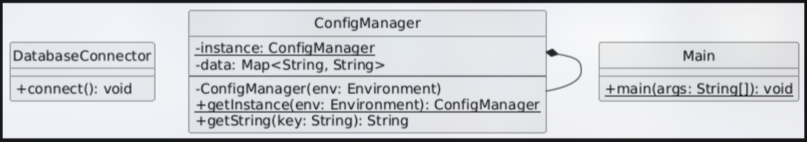

## ConfigManager using Singleton Desing Pattern

### Task
Create a configmanager where we can pass different type of configurations and our application maintains that configuration consistently.

- There are 3 ENVIRONMENT for now 
    - ```stage```
    - ```prod```
    - ```dev```
- There are a total ```10``` threads which will simultaniosly try to access it.
- We need to make sure that the instance is created only once and not by every theread.
- Provide a single global access point
- Prevent use of partially created instance

### Solution

#### UML Diagram


#### Solution Description

The object creation hapens in the ```ConfigManager.java``` file. This file is responsible for creating and providing the instance for accessing the environment configuration. 
<br>
Below is the Complete code, however we will discuss in detail about each of its pieces and how it actually help us achive our desired functionalities.

#### Code

```java
package com.configmanager.config;
import java.util.*;

public class ConfigManager {

    private static volatile ConfigManager instance;
    private Map<String, String> data;

    private ConfigManager(Environment env) {
        System.out.println("Loading config for " + env + "...");
        data = new HashMap<>();
        data.put("message", "Hello from " + env);
    }

    public static ConfigManager getInstance(Environment env) {
        ConfigManager result = instance;
        if (result == null) {
            synchronized (ConfigManager.class) {
                result = instance;
                if (result == null) {
                    instance = result = new ConfigManager(env);
                }
            }
        }
        return result;
    }

    public String getString(String key) {
        return data.get(key);
    }
}
```

#### Basic initialization of a singleton pattern

Here is a very basic initialization of a singleton pattern.
- Created a static variable known as instance which means it is globally accessible
- Made the Constructor <strong> private </strong>

```java
public class ConfigManager {

    private static ConfigManager instance;
    private Map<String, String> data;

    private ConfigManager(Environment env) {
        System.out.println("Loading config for " + env + "...");
        data = new HashMap<>();
        data.put("message", "Hello from " + env);
    }

    public static ConfigManager getInstance(Environment env) {
            if (result == null) 
                instance = result = new ConfigManager(env);
            return result;
    }

    public String getString(String key) {
        return data.get(key);
    }
}
```

<strong> Hey! that's it you have implemented a Singleton Design pattern to create your own configuration manager. </strong> <br>
But can you figure out what might go wrong with this code in production. Yes, you are correct if you thought about multi-threading system. 
<br>

#### Problem 2:
<strong> <i>
The major problem that your system may face is that the other instances will not wait for your ConfigManager instance to get fully initialized or ready. </i>
</strong> 
That is while thread A may instantiating the ConfigManager thread B might start using it. Therefor, to overcome it we make the instance variable <b>Volatile</b>. This make sure that the variable is only available when it is completely initialized.

```java
    private static volatile ConfigManager instance;
```

#### Problem 2:
<strong> <i>


</i></strong> 